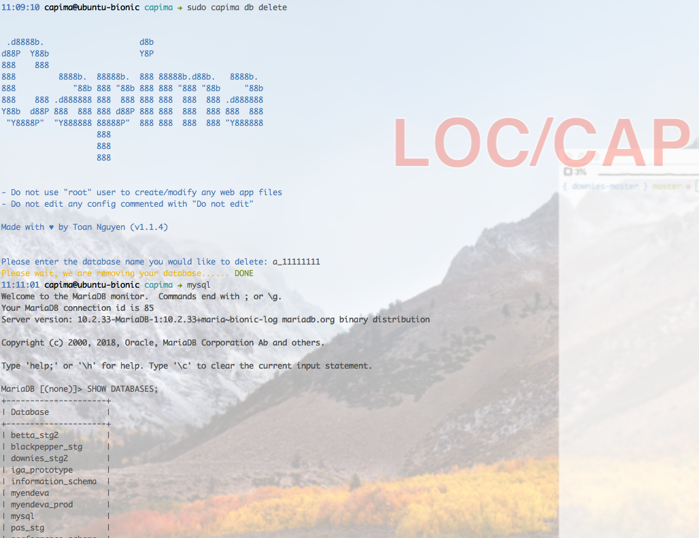
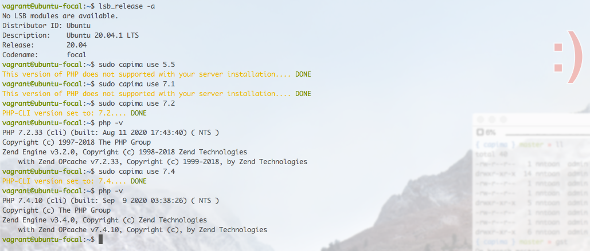

# What is Capima?

Capima is a modern web server stack designed to help you manage your PHP web application and websites easier and faster. Our stack is _production-ready_ stack which currently in used for many customers around the globe.


> Installing, configuring and optimizing your web server has never been so easy.

# Getting Started

## Requirements

Before you can use Capima, please make sure your server fulfils these requirements.

Software requirement

* Ubuntu 16.04/18.04/20.04 x86_64 LTS (Fresh installation)
* If the server is virtual (VPS), OpenVZ may not be supported (Kernel 2.6)

Hardware requirement

* More than 5GB HDD
* At least 2 core processor
* 2048MB minimum RAM

*Highly recommend* to spin up your first Capima server with <a href="https://www.jdoqocy.com/click-100471996-12454592" target="_top">Contabo VPS</a> - a promise of German quality at incredible prices.

## What's installed with Capima?

* nginX (frontend - port 80)
* Apache 2 (backend - port 81)
* PHP-FPM
  * 5.5 (only available in 16.04)
  * 5.6 (only available in 16.04)
  * 7.0 (only available in 18.04)
  * 7.1 (only available in 18.04)
  * 7.2
  * 7.3
  * 7.4
* MariaDB 10.4
  * Performance optimised for general purposes.
* Node.js LTS (12.x)
* Python
  * Python 3 if Ubuntu 20.04.
* Redis (can be enabled later by CLI)
* ElasticSearch (can be enabled later by CLI)
  * 5.x if Ubuntu 16.04
  * 6.x if Ubuntu 18.04
  * 7.x if Ubuntu 20.04 
* MailHog (can be enabled later by CLI)
* Postfix
* Memcached (disabled by default)
* Beanstalk (disabled by default)
* Firewalld
  * Port 22, 80, 443 accessible by default.
  * ufw, iptables will be disabled/removed.
* Fail2ban

## Installation

Run the following command with sudo or root user.

```bash
export DEBIAN_FRONTEND=noninteractive; echo 'Acquire::ForceIPv4 "true";' | sudo tee /etc/apt/apt.conf.d/99force-ipv4; sudo apt-get update; sudo apt-get install curl netcat-openbsd ca-certificates wget -y; curl -4 --silent --location https://capima.nntoan.com/files/installers/install.sh | sudo bash -; export DEBIAN_FRONTEND=newt
```


## Usage

After installed, you are able to manage your webservers by the following command.

```bash
$ sudo capima

CAPIMA v0.0.0

Usage:
 capima [commands] [options]

Options:
 --version(-v)    Display current version.
 --help(-h)       Display this help message.
 --quiet(-q)      Do not output any message.
 --ansi           Force ANSI output.
 --no-ansi        Disable ANSI output.

Available commands:
 web              Webapps management panel (add/update/delete).
 db               Databases management panel (add/update/delete).
 use              Switch between version of PHP-CLI.
 enable           Enable optional services (elasticsearch, redis, mailhog).
 restart          Restart Capima services.
 info             Show webapps information (under development).
 logs             Tail the last 200 lines of logfile (apache,fpm,nginx).
 self-update      Check latest version and performing self-update.
```

Please note that you will need to switch to `capima` user in order to work with your app files.

```bash
$ sudo su - capima
```

`capima` user can use `sudo capima` without being prompted password. That command is the only sudo command `capima` user can use. We **DO NOT** recommend to give `capima` full `sudo` privileges. Webserver user should never given `sudo` privileges as per security best practices.


## List of commands

Quick guide of commands available in Capima for configuration and adjustment of this application.

### WEB

Manage your websites, create, delete, disable your sites, enable SSL for any of your sites.

```bash
$ sudo capima web add
```

You will enter the interactive mode like the following screenshots:


```bash
$ sudo capima web delete
```

Enter the app name you would like to delete:


### DB

Manage your databases.

```bash
$ sudo capima db add
```

Adding new database


```bash
$ sudo capima db delete
```

Delete a database



### USE

Switch your PHP-CLI version quickly.

```bash
$ sudo capima use x.x
```

Replace x.x with your targeted PHP version (e.g 7.1):



# License

Capima is released under the [MIT License](LICENSE.md).
